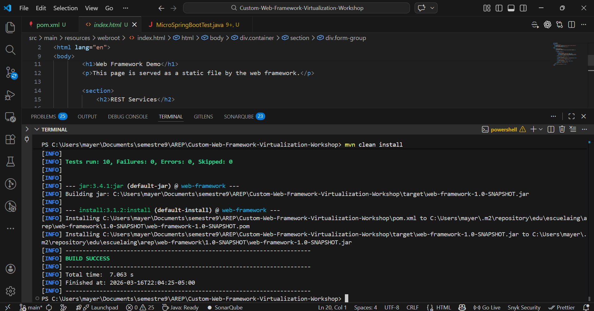
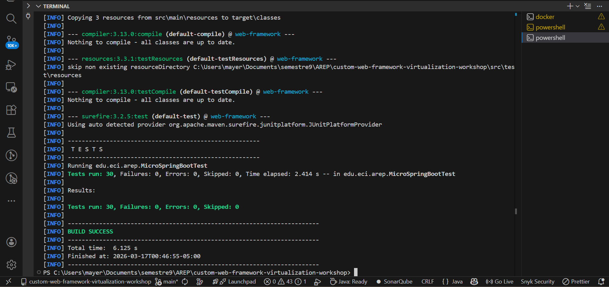
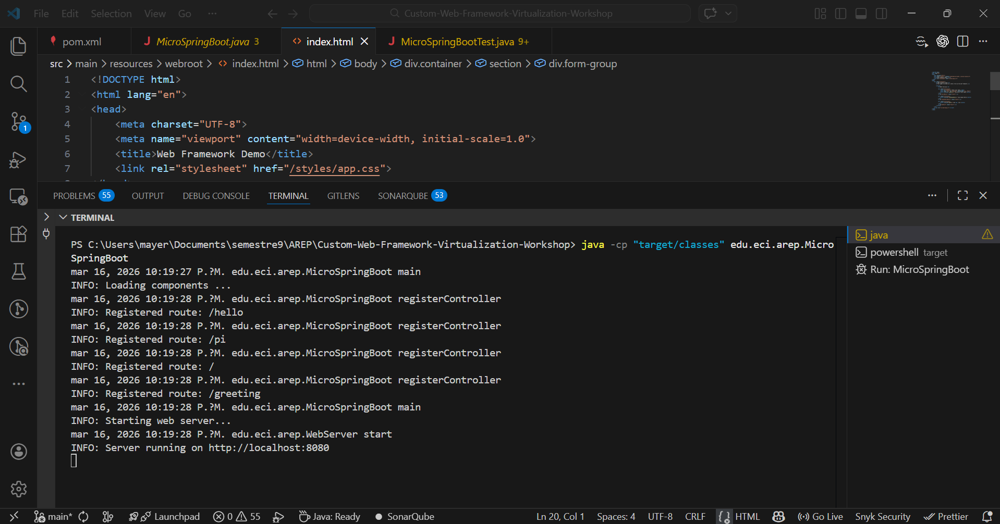
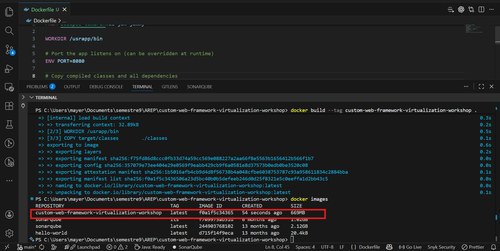
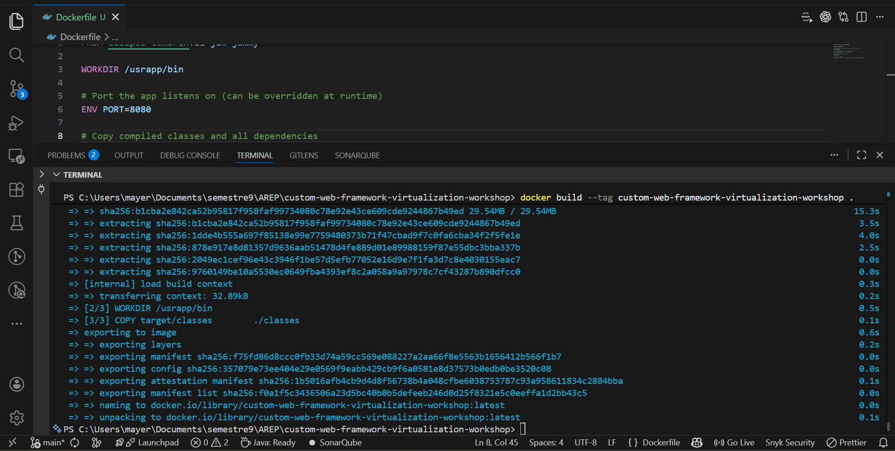
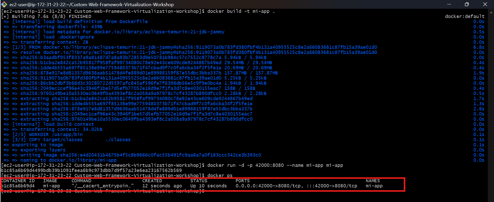
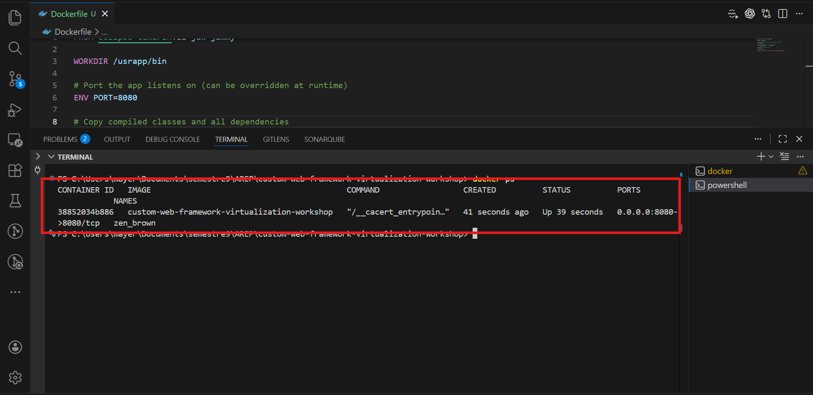

# Custom Web Framework - Virtualization Workshop

A lightweight custom Java web framework built from scratch without Spring, featuring concurrent request handling, graceful shutdown, and Docker deployment on AWS EC2. This implementation demonstrates how to build an embedded HTTP server with annotation processing via reflection, automatic component discovery, concurrent request handling, and graceful shutdown without depending on external frameworks.

## Features

- @RestController: Annotation to identify classes that define web services
- @GetMapping: Annotation to map methods to HTTP GET routes
- @RequestParam: Annotation to extract query parameters from HTTP requests
- Auto-discovery: Automatically loads classes annotated with @RestController
- Embedded web server: Integrated HTTP server that handles multiple concurrent requests
- Concurrent request handling: Thread pool with 50 configurable worker threads
- Graceful shutdown: Elegant shutdown using JVM Runtime shutdown hooks
- Static files: Service for HTML, CSS, JavaScript, and image files
- Dynamic reflection: Automatic component discovery using Java Reflection API
- Docker containerization: Ready for containerized deployment
- AWS EC2 ready: Environment variable configuration for cloud deployment

## Requirements

- Java 21 or higher
- Maven 3.8.0 or higher
- Docker (for containerization, optional)

## Build

```bash
mvn clean package
```

The project generates an executable JAR in `target/`.



## Usage

### Step 1: Compile the project

```bash
cd custom-web-framework-virtualization-workshop
mvn clean package
```

### Step 2: Run the server

#### Option 1: Auto-discovery of components

```bash
java -cp target/classes edu.eci.arep.MicroSpringBoot
```

The server will start at `http://localhost:8080` (or the specified PORT)

### Step 3: Test the endpoints

#### Available routes with HelloController

- `http://localhost:8080/` - Returns "Greetings from MicroSpringBoot"
- `http://localhost:8080/hello` - Returns "Hello World!"
- `http://localhost:8080/pi` - Returns "PI = 3.141592653589793"

#### Available routes with GreetingController

- `http://localhost:8080/greeting` - Returns "Hola World" (default value)
- `http://localhost:8080/greeting?name=Pedro` - Returns "Hola Pedro"
- `http://localhost:8080/greeting?name=Juan` - Returns "Hola Juan"

## Annotation Implementation

### @RestController

Marks a class as a REST component that will be discovered by the framework.

```java
@RestController
public class MyController {
    // All methods with @GetMapping will be registered
}
```

Purpose: Identify classes that expose REST services. The framework automatically scans classes with this annotation.

### @GetMapping

Defines a GET HTTP route for a method. The method must return `String`.

```java
@GetMapping("/my-route")
public String myMethod() {
    return "Response";
}
```

Purpose: Map methods to specific HTTP routes. The resulting URL is `http://localhost:8080/my-route`.

### @RequestParam

Extracts input parameters from the query string.

```java
@RequestParam(value = "name", defaultValue = "DefaultValue")
String name
```

Parameters:
- `value`: Name of the parameter in the URL (e.g., `?name=...`)
- `defaultValue`: Default value if the parameter is not provided

## Examples

### Example 1: Create a new controller

Create the file `MyController.java` in `src/main/java/edu/eci/arep/`:

```java
package edu.eci.arep;

@RestController
public class MyController {
    
    @GetMapping("/api/users")
    public String getUsers() {
        return "[{\"id\": 1, \"name\": \"Pedro\"}, {\"id\": 2, \"name\": \"Juan\"}]";
    }
    
    @GetMapping("/api/status")
    public String getStatus(@RequestParam(value = "code", defaultValue = "200") String code) {
        return "Status: " + code;
    }
}
```

Build and run:
```bash
mvn clean compile
java -cp target/classes edu.eci.arep.MicroSpringBoot
```

Test:
- `http://localhost:8080/api/users`
- `http://localhost:8080/api/status`
- `http://localhost:8080/api/status?code=404`

## Technical Details

### Architecture

```
HTTP Request
     ↓
WebServer.handleConnection()
     ↓
Route registered?
     ├─ Yes → WebFramework.get() → Controller method
     │         ↓
     │      HttpRequest (extracted parameters)
     │         ↓
     │      invokeMethod() (reflection for parameters)
     │         ↓
     │      String response
     │         ↓
     │      HttpResponse
     ├─ No → Static file (webroot/)
             ↓
          HTTP Response
```

### Concurrency Model

- Thread Pool Size: 50 configurable worker threads
- Thread Pool Queue: Unbounded queue for tasks
- Request Processing: Each incoming connection is assigned to a thread pool task
- Lock-free: Routes map is thread-safe (reads don't require locks)
- Resource Cleanup: Try-with-resources ensures socket/stream cleanup

### Graceful Shutdown Mechanism

The framework implements elegant shutdown using JVM Runtime shutdown hooks:

```java
Runtime.getRuntime().addShutdownHook(new Thread(() -> {
    // 1. Stop accepting new connections
    running = false;
    
    // 2. Close server socket
    serverSocket.close();
    
    // 3. Stop accepting new tasks
    executor.shutdown();
    
    // 4. Wait for active tasks (max 10 seconds)
    executor.awaitTermination(10, TimeUnit.SECONDS);
    
    // 5. Force shutdown if needed
    executor.shutdownNow();
}));
```

Features:
- Prevents abrupt connection termination
- Completes in-flight requests before shutdown
- Timeout safeguard prevents indefinite waiting
- Logs each shutdown phase for debugging

### How it works

1. Scanning: MicroSpringBoot scans the classpath looking for classes annotated with `@RestController`
2. Registration: For each method annotated with `@GetMapping`, it registers the route in WebFramework
3. Server: Starts an HTTP server on port 8080 that handles requests concurrently
4. Parameter handling: Automatically extracts query parameters using `@RequestParam`
5. Response: Invokes the corresponding method via reflection and returns the result as text
6. Shutdown: Handles graceful shutdown when receiving SIGTERM signal

### Server features

- Port: 8080 (configurable via PORT environment variable)
- Static files: HTML, CSS, JavaScript, PNG, JPG from `webroot/`
- Thread pool: 50 threads to handle concurrent requests
- Route handling: First searches registered routes, then static files
- Graceful shutdown: Completes in-flight requests before terminating

## Testing

Run unit tests:

```bash
mvn test
```

The tests validate:
- ✓ Discovery of @RestController annotations
- ✓ Route mapping with @GetMapping
- ✓ Parameter extraction with @RequestParam
- ✓ Default values for parameters
- ✓ Correct HTTP response
- ✓ Response content and status
- ✓ Concurrent request handling



### Concurrent Request Testing

Test concurrent handling with ApacheBench:

```bash
# Install ab (Apache tools)
# Ubuntu/Debian: sudo apt-get install apache2-utils
# Amazon Linux: sudo yum install httpd-tools -y
# macOS: brew install httpd

# Run 1000 requests with 50 concurrent threads
ab -n 1000 -c 50 http://localhost:8080/

# Example output:
# Requests per second:    500 [#/sec] (mean)
# Time per request:       2.000 [ms] (mean)
# Failed requests:        0
# Concurrency Level:      50
```

## Deployment on Docker

### Build Docker Image

```bash
mvn clean package
docker build -t micro-springboot:latest .
```

### Run Single Container

```bash
docker run -p 8080:8080 \
    -e PORT=8080 \
    micro-springboot:latest
```

Access at: http://localhost:8080



### Run with Docker Compose (Multiple Instances)

```bash
docker-compose up -d
```

This will start 3 instances with load balancing setup:
- Instance 1: http://localhost:8080 (internal port 6000)
- Instance 2: http://localhost:8081 (internal port 6000)
- Instance 3: http://localhost:8082 (internal port 6000)

Stop services:
```bash
docker-compose down
```



### Docker Configuration

The `Dockerfile` uses:
- Base image: `eclipse-temurin:21-jdk-jammy` (Java 21 + Linux)
- Workdir: `/usrapp/bin`
- Port: 8080 (configurable via `PORT` env var)
- CMD: Starts the framework with auto-discovery enabled



## Deployment on AWS

### Prerequisites

1. Active AWS account
2. Access to EC2
3. Java 21 installed locally
4. Git installed
5. Docker installed (for pushing to ECR)

### Step 1: Create EC2 instance

1. Go to AWS Console → EC2
2. Click "Launch Instance"
3. Select:
   - AMI: Amazon Linux 2 or Ubuntu 22.04
   - Instance Type: t2.micro or t2.small (eligible for free tier)
   - Storage: At least 20GB
   - Security Group: Create new with rules:
     - SSH (22) from your IP
     - HTTP (80) from 0.0.0.0/0
     - HTTP (8080) from 0.0.0.0/0
     - HTTP (8081, 8082) from 0.0.0.0/0 (if using multiple instances)

4. Create and download the key pair (.pem)
5. Launch the instance

### Step 2: Connect to the instance

```bash
# Make the key executable
chmod 400 your-key.pem

# Connect
ssh -i your-key.pem ec2-user@<instance-public-IP>
```

### Step 3: Install requirements on Amazon Linux

```bash
# Update system
sudo yum update -y

# Install Java 21
sudo yum install -y java-21-amazon-corretto

# Install Git
sudo yum install -y git

# Install Docker
sudo amazon-linux-extras install docker -y
sudo systemctl start docker
sudo usermod -a -G docker ec2-user

# Install Maven (optional, if you need to compile on the instance)
sudo yum install -y maven
```

### Step 4: Clone the repository

```bash
# Clone from GitHub
git clone https://github.com/your-username/AREP.git
cd AREP/custom-web-framework-virtualization-workshop
```

### Step 5: Build the project

```bash
# Build the project
mvn clean package
```

### Step 6: Build and run Docker container

```bash
# Build Docker image
docker build -t micro-springboot:latest .

# Run the container in background
docker run -d --name springboot-app \
    -p 8080:8080 \
    -e PORT=8080 \
    micro-springboot:latest
```

### Step 7: Verify the instances on AWS

```bash
# Check if container is running
docker ps

# Test the application endpoints
curl http://localhost:8080/
curl http://localhost:8080/hello
curl http://localhost:8080/greeting?name=Pedro
```



### Step 8: Verify running image



### Access the application

- Locally: `http://localhost:8080`
- On AWS: `http://<public-or-elastic-IP>:8080`

### Deployment Evidence

Video evidence of the application deployment and running successfully:


### Optional: Setup Reverse Proxy (Nginx)

For production, use Nginx to handle load balancing and multiple instances:

```bash
# Install Nginx
sudo yum install nginx -y
sudo systemctl start nginx

# Edit /etc/nginx/nginx.conf configuration
# Add upstream block for load balancing
```

### Monitoring & Maintenance

```bash
# View logs
docker logs -f springboot-app

# Monitor resource usage
docker stats springboot-app

# Stop container
docker stop springboot-app

# Restart container
docker restart springboot-app

# Remove container
docker rm springboot-app

# Restart on failure
docker run -d --restart unless-stopped \
    --name springboot-app \
    -p 8080:8080 \
    micro-springboot:latest
```

## Development notes

- The framework uses reflection to discover components at runtime
- Controllers must have parameter-less constructors
- Methods with @GetMapping must return String
- Query parameters are automatically extracted
- Thread pool size can be adjusted by modifying `THREAD_POOL_SIZE` in WebServer.java
- Graceful shutdown is automatic via JVM shutdown hooks

## Author

- **Mayerlly Suárez Correa** [mayerllyyo](https://github.com/mayerllyyo)

## License

This project is licensed under the MIT License - see the [LICENSE](LICENSE) file for details
